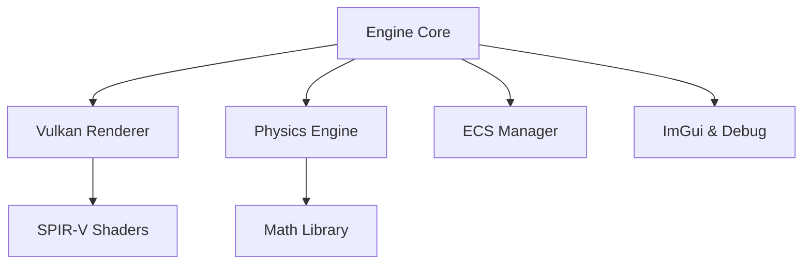

# 🎯 MASTER PLAN: Vulkan C++ Graphics & Physics Engine

## 1. Proje Kimliği (Identity & Vision)
Bu proje, Vulkan 1.3 ve C++20/23 kullanılarak geliştirilen **yüksek performanslı bir Pixel Art üretim ve simülasyon fabrikasıdır.**

- **Vizyon**: Godot üzerindeki 2D Pixel Art projeleri için elle çizilmesi zor olan fiziksel animasyonları (yıkım, akışkanlar, dinamik ışıklandırma) 3D gücüyle hesaplayıp, optimize edilmiş pikselli spritesheet'ler üretmek.
- **Godot Sinerjisi**: Otomatik Spritesheet üretimi, Normal Map export (2.5D ışıklandırma için) ve fizik verisi aktarımı.

---

## 2. Teknik Mimari (Architecture)
Motor, birbirine gevşek bağlı (loosely coupled) şu ana modüllerden oluşur:

---

## 3. Yol Haritası (Roadmap)
- **Faz 0-2 (Tamamlandı)**: Temel altyapı, Vulkan Triangle, 3D Mesh & Texture loading.
- **Faz 3-4 (Tamamlandı)**: Kamera sistemi, Input Manager, ImGui entegrasyonu, Profiler.
- **Faz 5 (Aktif)**: **Simulation Engine**: 2D kısıtlı fizik simülasyonu ve Pixelation Shader entegrasyonu.
- **Faz 6**: **The Baker**: Kare dondurma (Capture), renk paleti sınırlama ve Spritesheet oluşturma altyapısı.
- **Faz 7**: **Godot Bridge**: Üretilen `.png` ve `.json` verilerinin Godot'ya otomatik aktarımı.

---

## 4. AI İş Birliği & Kodlama Standartları (Rules)
- **Single Source of Truth**: Bu dosya ve `progress.md`.
- **Dil**: Kod İngilizce, dokümantasyon/yorumlar Türkçe.
- **Bellek Yönetimi**: RAII prensibi ve Vulkan için VMA kullanımı.
- **Güvenlik**: Her faz sonunda AI ile "Security Audit" yapılması zorunludur.

---

## 6. Final Vizyonu (What's at the end of Phase 7?)
Faz 7 bittiğinde elimizde şunlar olacak:
- **Production-Ready Core**: Kendi 3D oyunlarımızı veya simülasyonlarımızı geliştirebileceğimiz, Vulkan tabanlı yüksek performanslı bir motor çekirdeği.
- **Teknik Kanıt**: Modern C++ ve grafik programlama yetkinliğinin en üst seviye kanıtı (Portfolyo başyapıtı).
- **Genişletilebilirlik**: Ray tracing, gelişmiş yapay zeka ve multiplayer gibi modüllerin kolayca eklenebileceği temiz bir iskelet.
