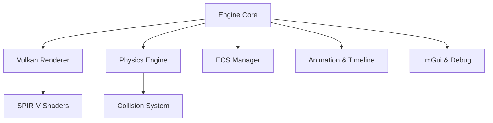

# MASTER PLAN: Vulkan C++ Graphics & Physics Engine

## 1. Proje Kimligi (Identity & Vision)
Bu proje, Vulkan 1.3 ve C++20/23 kullanilarak gelistirilen yuksek performansli bir Pixel Art uretim ve simulasyon fabrikasidir.

- Vizyon: Godot uzerindeki 2D Pixel Art projeleri icin elle cizilmesi zor olan fiziksel animasyonlari (yikim, akis kanlar, dinamik isiklandirma) 3D gucuyle hesaplayip, optimize edilmis pikselli spritesheet'ler uretmek.
- Godot Sinerjisi: Otomatik spritesheet uretimi, normal map export (2.5D isiklandirma icin) ve fizik verisi aktarimi.

---

## 2. Teknik Mimari (Architecture)
Motor, birbirine gevsek bagli (loosely coupled) su ana modullerden olusur:

---

## 3. Yol Haritasi (Roadmap)
- Faz 0-2 (Tamamlandi): Temel altyapi, Vulkan Triangle, 3D mesh ve texture loading.
- Faz 3-4 (Tamamlandi): Kamera sistemi, Input Manager, ImGui entegrasyonu, Profiler.
- Faz 5 (Tamamlandi): Physics Engine (Collision Detection & Response).
- Faz 6A1 (Tamamlandi): Lighting System (Visual Upgrade).
- Faz 5.5 (Aktif): Animation-to-Bake Bridge.
  - Skeletal/transform animation pipeline.
  - Shot authoring (kamera/isik presetleri).
  - Deterministik playback (play/pause/step/reset/seed).
  - Bake-oncesi pixel stilizasyon kurallari (pixel snap, palette preview).
- Faz 6 (Siradaki): The Baker.
  - Render-to-Texture capture.
  - PNG frame export.
  - Spritesheet atlas + metadata cikisi.
- Faz 7: Godot Bridge.
  - Uretilen `.png` ve `.json` verilerinin Godot'ya otomatik aktarimi.

---

## 4. Faz 5.5 Cikis Kriterleri (Definition of Done)
- En az bir model animasyon klibi timeline uzerinden deterministic sekilde tekrar oynatilabilir.
- Sabit kamera/isik presetleri ile ayni inputtan ayni frame cikisi alinabilir.
- Frame-range secimi ile bake adimina hazir image sequence uretilebilir.
- ImGui uzerinden play/pause/step/reset ve frame araligi secimi yapilabilir.

---

## 5. AI Is Birligi & Kodlama Standartlari (Rules)
- Single Source of Truth: Bu dosya ve `progress.md`.
- Dil: Kod Ingilizce, dokumantasyon/yorumlar Turkce.
- Bellek Yonetimi: RAII prensibi; Vulkan memory yonetimi VMA ile standardize edilecek.
- Guvenlik: Her faz sonunda AI ile Security Audit yapilmasi zorunludur.

---

## 6. Final Vizyonu (What's at the end of Phase 7?)
Faz 7 sonunda:
- Production-ready core: 3D simulasyon ve oyun gelistirme icin yuksek performansli, Vulkan tabanli cekirdek.
- Teknik kanit: Modern C++ ve grafik programlama yetkinliginin guclu portfolio cikisi.
- Genisletilebilirlik: Ray tracing, ileri AI ve multiplayer gibi modullerin kolay entegrasyonu.
